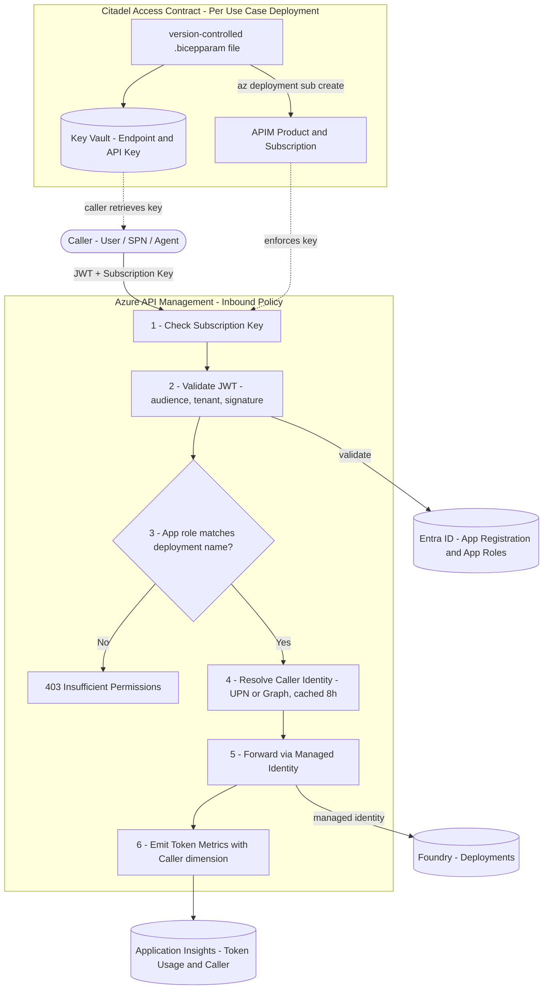

# Gateway Architecture Diagram

> **Using in presentations**  
> Copy the Mermaid block into [mermaid.live](https://mermaid.live) → **Export → PNG or SVG** for pasting into PowerPoint / Keynote / Slides.  
> The diagram also renders natively in GitHub, VS Code preview, Confluence, and Notion.

## Key Points

- **Dual-credential access control** — every AI API call must carry both an Entra ID JWT (proving *who* the caller is and *which model* they are allowed to use via app roles) and an APIM subscription key (proving *which use case* is making the call)
- **Zero standing secrets to callers** — APIM forwards to Foundry using its own managed identity; callers never hold a Cognitive Services key
- **Governed onboarding via AI Access Contracts** — each use case is onboarded by deploying a version-controlled Bicep parameter file (the *contract*), which automatically creates an isolated APIM product, subscription key, and Key Vault secrets — no manual portal steps
- **Full auditability** — every request is tagged with the resolved caller identity (UPN or service principal name) in Application Insights token metrics, giving per-user, per-deployment cost and usage visibility

## Benefits

| Benefit | Detail |
|---------|--------|
| **Security by default** | No request reaches Azure OpenAI without a valid Entra ID token AND a use-case subscription key — two independent layers of enforcement |
| **Least-privilege access** | App roles constrain each user or service principal to only the model deployments they are explicitly authorised for; a compromise of one credential cannot access other deployments |
| **No credential sprawl** | Callers never hold an Azure OpenAI API key; the gateway's managed identity is the only credential with access to the AI backend |
| **Repeatable, auditable onboarding** | Each use case is a pull-request-reviewable `.bicepparam` file — onboarding, changes, and offboarding are all tracked in Git with no manual portal steps |
| **Isolated cost and quota per use case** | Every use case gets its own APIM product with its own token-limit policy, preventing one team from consuming another team's quota |
| **Full spend visibility** | Application Insights captures token usage broken down by caller identity and deployment, enabling per-team, per-project chargeback reporting |
| **Portable pattern** | Built on the open-source [Foundry Citadel Platform](https://github.com/azure-samples/ai-hub-gateway-solution-accelerator/tree/citadel-v1) — the AI Access Contract pattern is reusable across any Azure OpenAI deployment |

---

This diagram shows the two layers introduced by the `jwtauth` and `usecaseonboard` branches, implementing the **AI Access Contract** principle from the [Foundry Citadel Platform](https://github.com/azure-samples/ai-hub-gateway-solution-accelerator/tree/citadel-v1):

- **Top half — Runtime**: every API call passes through JWT validation, role-based access control, and managed identity forwarding inside APIM
- **Bottom half — Deployment-time**: each use case is onboarded by deploying a version-controlled `.bicepparam` contract that creates the APIM product/subscription and writes secrets to Key Vault

---

---

### Colour legend

| Colour | Meaning |
|--------|---------|
| 🟣 Purple | Caller (user, SPN, or agent) |
| 🔵 Blue | Azure managed services (Entra ID, Foundry) |
| 🟢 Green | APIM policy steps (happy path) |
| 🔴 Red | Rejection path (403) |
| 🩵 Teal | Observability (Application Insights) |
| ⬛ Dark grey | Infrastructure-as-code (Citadel Access Contract) |
| 🟠 Amber | Credentials store (APIM Subscription, Key Vault) |

---

*Solid arrows = runtime request flow · Dashed arrows = deployment-time configuration*
