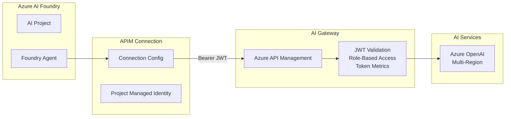
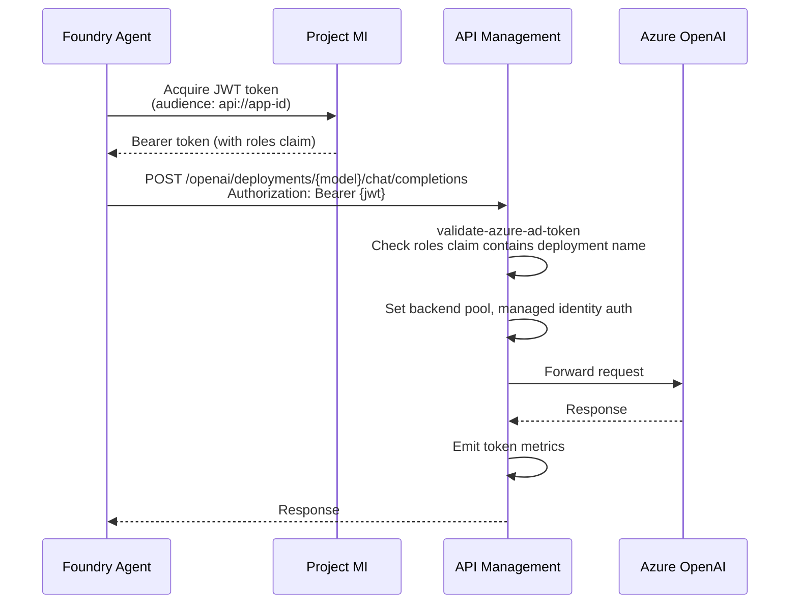

# 🔌 Azure AI Foundry - APIM Connection Integration

This module enables Azure AI Foundry projects to access AI models through your Azure API Management (APIM) gateway, supporting the **Bring Your Own AI Gateway** pattern for enterprise AI governance.

## 📋 Overview

The APIM connection integration allows organizations to:

- **Maintain control** over model endpoints behind your existing governance hub
- **Build agents** that leverage models without exposing them publicly  
- **Apply governance** requirements to AI model access through APIM policies (JWT validation, role-based model access, token metrics)
- **Use Entra ID authentication** via ProjectManagedIdentity — no subscription keys needed

### Architecture



### Request Flow



---

## 📁 Folder Structure

```
foundry-integration/
├── main.bicep                          # Bicep template — creates an APIM connection in a Foundry project
├── agent.template.bicepparam           # Template parameter file — copy and fill in your values
└── README.md                           # This documentation
```

---

## ✅ Prerequisites

| Requirement | Description |
|-------------|-------------|
| **Azure Subscription** | Access to subscription containing AI Foundry |
| **AI Foundry Project** | Existing Foundry account and project with Agent Service configured |
| **APIM Gateway** | Deployed AI Gateway with `azure-openai-api` (path: `openai`) |
| **Entra ID App Registration** | App registration with app roles per deployment name |
| **Azure CLI** | Latest version with Bicep support |
| **Permissions** | Contributor on Foundry resource group, Application Administrator for role assignments |

---

## 🚀 Quick Start

### Step 1: Configure Parameters

Copy the template parameter file and fill in your values:

```bash
cp agent.template.bicepparam my-project.bicepparam
```

Edit `my-project.bicepparam` — replace all `<PLACEHOLDER>` values:

```bicep
using 'main.bicep'

// Foundry account and project
param aiFoundryAccountName = '<YOUR-AI-FOUNDRY-ACCOUNT-NAME>'
param aiFoundryProjectName = '<YOUR-AI-FOUNDRY-PROJECT-NAME>'
param connectionName = 'citadel-hub-connection'

// APIM Gateway
param apimGatewayUrl = '<YOUR-APIM-GATEWAY-URL>'   // e.g., https://my-apim.azure-api.net
param apiPath = 'openai'

// PMI Auth — no subscription key needed
param authType = 'ProjectManagedIdentity'
param audience = 'api://<YOUR-APIM-APP-REGISTRATION-CLIENT-ID>'
param isSharedToAll = true

// APIM Config
param deploymentInPath = 'true'
param inferenceAPIVersion = '2024-12-01-preview'  // Must match APIM api-version

// Static models — list each model your agent needs access to
param staticModels = [
  {
    name: '<DEPLOYMENT-NAME>'           // e.g., 'gpt-5-mini'
    properties: {
      model: {
        name: '<MODEL-NAME>'            // e.g., 'gpt-5-mini'
        version: '<MODEL-VERSION>'      // e.g., '2025-08-07'
        format: 'OpenAI'
      }
    }
  }
]

// Disable dynamic discovery (required when using static models)
param listModelsEndpoint = ''
param getModelEndpoint = ''
param deploymentProvider = ''
```

### Step 2: Assign App Roles to Project Managed Identity

The Agent Service uses the **project's managed identity** (system-assigned MI on the project resource) to acquire a JWT token for APIM. The APIM policy checks the `roles` claim in the JWT to authorize access to specific model deployments.

```powershell
# 1. Get the project managed identity principal ID
$projectMI = az rest --method GET `
  --url "https://management.azure.com/subscriptions/<sub-id>/resourceGroups/<rg>/providers/Microsoft.CognitiveServices/accounts/<account>/projects/<project>?api-version=2025-04-01-preview" `
  --query "identity.principalId" -o tsv

# 2. Also get the agent identity (if using private agent setup)
$agentId = az rest --method GET `
  --url "https://management.azure.com/subscriptions/<sub-id>/resourceGroups/<rg>/providers/Microsoft.CognitiveServices/accounts/<account>/projects/<project>?api-version=2025-04-01-preview" `
  --query "properties.agentIdentity.agentIdentityId" -o tsv

# 3. Assign app roles to BOTH identities (for each model deployment)
#    ServicePrincipalId = project MI or agent identity from above
#    ResourceId         = SP object ID of your Entra ID app registration
#    AppRoleId          = ID of the app role matching the deployment name
New-AzADServicePrincipalAppRoleAssignment `
  -ServicePrincipalId $projectMI `
  -ResourceId <app-registration-sp-id> `
  -AppRoleId <role-id-for-deployment>

New-AzADServicePrincipalAppRoleAssignment `
  -ServicePrincipalId $agentId `
  -ResourceId <app-registration-sp-id> `
  -AppRoleId <role-id-for-deployment>
```

> **Note:** The project MI identity (not the agent identity) is what appears in the JWT `oid` claim. APIM trace logging confirmed `oid` matches the project MI and `roles` contains the assigned app role values (e.g., `gpt-5-mini,gpt-4o-mini-2024-07-18`).
>
> **Token caching:** Entra ID tokens are cached ~60-75 min. After assigning or removing roles, delete and recreate the connection to force a fresh token.

### Step 3: Deploy

```bash
az account set --subscription <foundry-subscription-id>

az deployment group create \
  --name foundry-apim-connection \
  --resource-group <foundry-resource-group> \
  --template-file main.bicep \
  --parameters my-project.bicepparam
```

### Step 4: Verify

Check the connection in Azure AI Foundry portal:
1. Navigate to your Foundry project
2. Go to **Connected resources**
3. Verify the connection appears with an Active status

### Step 5: Test

```bash
pip install azure-ai-projects>=2.0.0 azure-identity

export FOUNDRY_ACCOUNT=<your-foundry-account>
export FOUNDRY_PROJECT=<your-project>
python tests/test_foundry_agent.py
```

---

## 🔥 Troubleshooting

### Deployment hangs for 2 hours then fails

A soft-deleted CognitiveServices account with the same name is blocking recreation. Purge it first:

```bash
# List soft-deleted accounts
az rest --method GET \
  --url "https://management.azure.com/subscriptions/<sub-id>/providers/Microsoft.CognitiveServices/deletedAccounts?api-version=2025-04-01-preview"

# Purge the old account (adjust location)
az rest --method DELETE \
  --url "https://management.azure.com/subscriptions/<sub-id>/providers/Microsoft.CognitiveServices/locations/<region>/resourceGroups/<rg>/deletedAccounts/<account-name>?api-version=2025-04-01-preview"
```

### ParentResourceNotFound when listing capability hosts

The Foundry account or project no longer exists. Verify:

```bash
# Check account exists
az rest --method GET \
  --url "https://management.azure.com/subscriptions/<sub-id>/resourceGroups/<rg>/providers/Microsoft.CognitiveServices/accounts/<account>?api-version=2025-04-01-preview"

# List projects under the account
az rest --method GET \
  --url "https://management.azure.com/subscriptions/<sub-id>/resourceGroups/<rg>/providers/Microsoft.CognitiveServices/accounts/<account>/projects?api-version=2025-04-01-preview"
```

If the account was deleted, purge the soft-deleted account (see above) and redeploy.

### Correct deletion order

When tearing down a Foundry agent setup, delete resources in this order to avoid orphaned resources:

1. **Capability hosts** (agent compute)
2. **Connections** (APIM connection)
3. **Project**
4. **Foundry account**

Deleting the account first cascades to children but can leave orphaned networking resources (subnet locks, NICs) that block redeployment.

---

## 🔧 Configuration Details

### Authentication Types

| Type | `authType` Value | How It Works |
|------|-----------------|--------------|
| **ProjectManagedIdentity** (recommended) | `'ProjectManagedIdentity'` | Agent Service uses PMI to acquire JWT for the specified `audience`. Requires app role assignments. |
| **ApiKey** | `'ApiKey'` | Subscription key passed in `api-key` header. Requires `apimSubscriptionKey`. |
| **AAD** | `'AAD'` | ⚠️ Not recommended — causes "Connection not found" at runtime. Use `ProjectManagedIdentity` instead. |

### Model Discovery

| Method | When to Use | Key Settings |
|--------|-------------|-------------|
| **Static Models** (recommended) | APIM doesn't expose `/deployments` list endpoint | `staticModels = [...]`, set discovery params to `''` |
| **Dynamic Discovery** | APIM has `/deployments` endpoint configured | `listModelsEndpoint`, `getModelEndpoint`, `deploymentProvider` |

> ⚠️ **Important**: The template has non-empty defaults for `listModelsEndpoint` (`/deployments`), `getModelEndpoint` (`/deployments/{deployment-id}`), and `deploymentProvider` (`AzureOpenAI`). When using static models, you **must** explicitly set these to empty strings to prevent dynamic discovery from being enabled.

### Critical Parameters

| Parameter | Required Value | Why |
|-----------|---------------|-----|
| `inferenceAPIVersion` | `'2024-12-01-preview'` | APIM operation template includes `api-version` as a URL parameter. Without it, requests return 404. |
| `deploymentInPath` | `'true'` | Matches the `azure-openai-api` URL pattern: `/deployments/{model}/chat/completions` |
| `apiPath` | `'openai'` | Matches the APIM API path for `azure-openai-api` |
| `audience` | `'api://<app-client-id>'` | Must match the APIM `validate-azure-ad-token` audience |

---

## 📋 Parameter Reference

### Required Parameters

| Parameter | Type | Description |
|-----------|------|-------------|
| `aiFoundryAccountName` | string | Name of the AI Foundry account |
| `aiFoundryProjectName` | string | Name of the project within Foundry |
| `connectionName` | string | Unique name for the connection |
| `apimGatewayUrl` | string | APIM gateway URL (e.g., `https://my-apim.azure-api.net`) |
| `apiPath` | string | API path in APIM (e.g., `openai`) |

### Optional Parameters

| Parameter | Type | Default | Description |
|-----------|------|---------|-------------|
| `apimSubscriptionKey` | string | `''` | APIM subscription key (only for `ApiKey` auth) |
| `authType` | string | `'ApiKey'` | Authentication type: `ApiKey`, `AAD`, or `ProjectManagedIdentity` |
| `audience` | string | `''` | Token audience for PMI auth |
| `isSharedToAll` | bool | `false` | Share connection with all project users |
| `deploymentInPath` | string | `'false'` | Deployment name in URL path |
| `inferenceAPIVersion` | string | `''` | API version for inference calls |
| `staticModels` | array | `[]` | Static model list |
| `listModelsEndpoint` | string | `'/deployments'` | Discovery list endpoint (set to `''` for static models) |
| `getModelEndpoint` | string | `'/deployments/{deployment-id}'` | Discovery get endpoint (set to `''` for static models) |
| `deploymentProvider` | string | `'AzureOpenAI'` | Discovery provider format (set to `''` for static models) |
| `customHeaders` | object | `{}` | Custom request headers |
| `authConfig` | object | `{}` | Custom auth configuration |

---

## 🧪 Using the Connection in Agents

After creating the connection, use the `azure-ai-projects` SDK (v2.0.0+):

```python
from azure.ai.projects import AIProjectClient
from azure.ai.projects.models import PromptAgentDefinition
from azure.identity import DefaultAzureCredential

# Initialize client
project_client = AIProjectClient(
    endpoint="https://my-foundry.services.ai.azure.com/api/projects/my-project",
    credential=DefaultAzureCredential()
)

# Create prompt agent with connection_name/model_name format
agent = project_client.agents.create_version(
    agent_name="my-agent",
    definition=PromptAgentDefinition(
        model="citadel-hub-connection/gpt-5-mini",
        instructions="You are a helpful assistant."
    )
)

# Chat using conversations + responses API
with project_client.get_openai_client() as openai_client:
    conversation = openai_client.conversations.create(
        items=[{"type": "message", "role": "user", "content": "Hello!"}]
    )
    response = openai_client.responses.create(
        conversation=conversation.id,
        extra_body={"agent_reference": {"name": agent.name, "type": "agent_reference"}},
        input=""
    )
    print(response.output_text)

# Cleanup
project_client.agents.delete_version(agent_name=agent.name, agent_version=agent.version)
```

See `tests/test_foundry_agent.py` for a complete working example.

---

## 📚 References

- [Connect an AI gateway to Foundry Agent Service](https://learn.microsoft.com/en-us/azure/foundry/agents/how-to/ai-gateway)
- [APIM Connection Objects](https://github.com/azure-ai-foundry/foundry-samples/blob/main/infrastructure/infrastructure-setup-bicep/01-connections/apim/APIM-Connection-Objects.md)
- [Foundry Samples Repository](https://github.com/azure-ai-foundry/foundry-samples)
- [Azure AI Projects Agent Samples](https://github.com/Azure/azure-sdk-for-python/tree/main/sdk/ai/azure-ai-projects/samples/agents)
- [Private Network APIM Setup](https://github.com/azure-ai-foundry/foundry-samples/tree/main/infrastructure/infrastructure-setup-bicep/16-private-network-standard-agent-apim-setup-preview)

---

## ⚠️ Known Limitations

| Limitation | Details |
|------------|---------|
| **Preview Status** | Feature is in preview with potential breaking changes |
| **UI Support** | Requires Azure CLI/Bicep for connection management |
| **Agent Support** | Only Prompt Agents in the Agent SDK |
| **APIM Tiers** | Standard v2 and Premium tiers supported |
| **Auth Types** | `ProjectManagedIdentity` and `ApiKey` work; `AAD` causes runtime issues |
| **isSharedToAll** | ARM API ignores this property (always returns `false`), but PMI connections work regardless |
| **Private Networking** | Private Foundry requires public access on the account or APIM private endpoint in the agent VNet |
| **agent_reference** | The `extra_body` property name is `agent_reference` (not `agent` — deprecated) || **Soft Delete** | Deleting a CognitiveServices account soft-deletes it; recreating with the same name hangs until purged |
